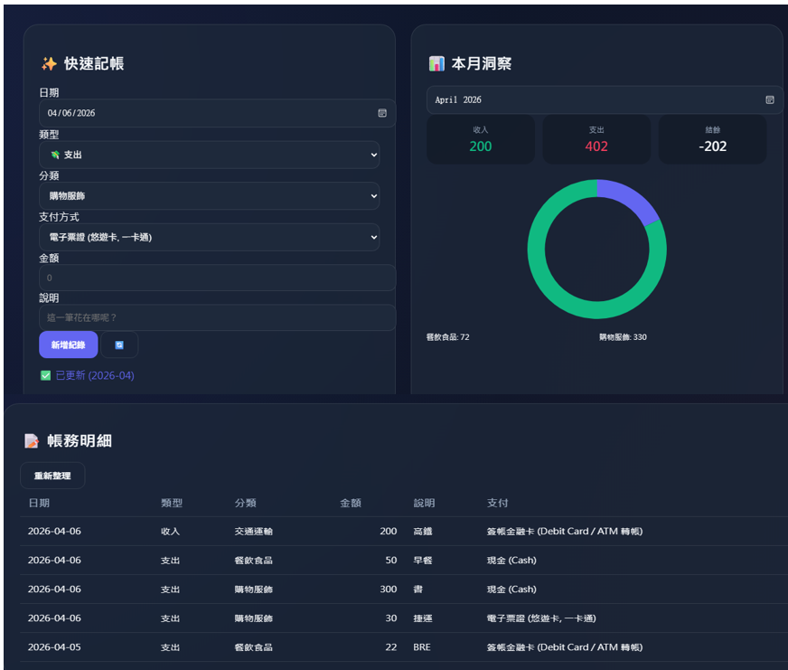
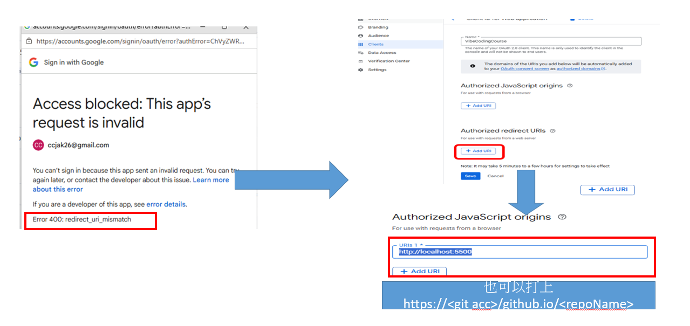
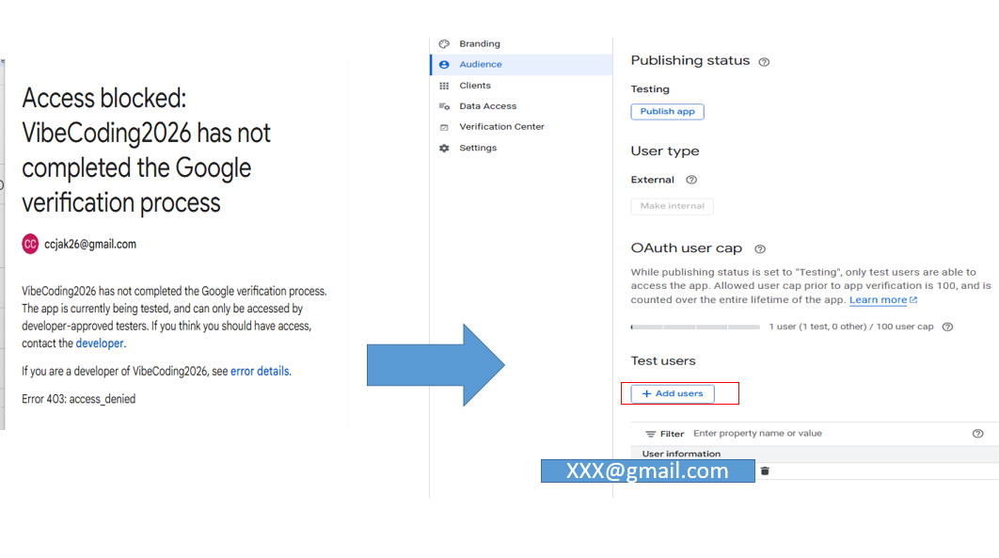

# **💰 記帳工具 — Google 試算表串接版**

這是一個專為現代人設計的個人財務管理工具。透過 **Google OAuth 2.0** 直接讀寫您自己的 Google 試算表，實現真正的「數據私有化」——您的支出與收入紀錄僅存在於您自己的雲端硬碟中。

## **📁 專案結構**

AI-coding-sample-Expense-Tracker2026/  
├── index.html   \# 頁面結構、Chart.js 畫布與 UI 組件  
├── styles.css   \# 樣式設計（微光玻璃風格，優化深色模式下拉選單）  
├── app.js       \# 核心邏輯：OAuth 2.0、Sheets API、圖表渲染與資料處理  
└── README.md    \# 本說明文件

## **🚀 快速開始**

### **1\. 準備 Google 試算表**

請在您的 Google 試算表中建立兩個分頁（工作表），名稱與欄位順序需如下設定：

**分頁一：記帳紀錄**

| ID | Date | Type | Category | Amount | Description | Payment |
| :---- | :---- | :---- | :---- | :---- | :---- | :---- |
| 1 | 2026-01-01 | 收入 | 其他雜項 | 55000 | 1 月份薪資收入 | 簽帳金融卡 (Debit Card / ATM 轉帳) |
| 2 | 2026-01-01 | 支出 | 居家生活 | 12000 | 1 月份房租 | 簽帳金融卡 (Debit Card / ATM 轉帳) |
| 3 | 2026-01-02 | 支出 | 餐飲食品 | 120 | 早餐店蛋餅大冰奶 | 現金 (Cash) |

**分頁二：欄位表**

| Type | Category | Payment |
| :---- | :---- | :---- |
| 支出 | 餐飲食品 | 現金 (Cash) |
| 收入 | 交通運輸 | 信用卡 (Credit Card) |
| (空白) | 居家生活 | 簽帳金融卡 (Debit Card / ATM 轉帳) |
| (空白) | 休閒娛樂 | 電子支付 (LINE Pay, Apple Pay, 街口支付) |

**💡 提示**：在 欄位表 中，Type 欄位若留白，表示該分類或支付方式會同時出現在「收入」與「支出」的下拉選單中。

### **2\. 申請 Google OAuth Client ID**

1. 前往 [Google Cloud Console](https://console.cloud.google.com/)。  
2. 建立新專案並啟用 **Google Sheets API**。  
3. 建立 OAuth 憑證：  
   * 「API 和服務」→「憑證」→「建立憑證」→「OAuth 2.0 用戶端 ID」。  
   * 應用程式類型選「**網路應用程式**」。  
   * 在「**授權的 JavaScript 來源**」加入您的網址（開發時建議填入 http://127.0.0.1:5500）。  
4. 複製產生的 **Client ID**。

### **3\. 套用設定檔 (app.js)**

開啟 app.js，將您的 Client ID 與試算表 ID 填入 CONFIG 物件：

const CONFIG \= {  
  CLIENT\_ID: "您的\_CLIENT\_ID.apps.googleusercontent.com",   
  SPREADSHEET\_ID: "1SfzzmaR4-vxHYUA21qUTEM0wxMLhjjrH2lycMfkKm4o", // 已根據您的表單更新

  SHEET\_RECORDS: "記帳紀錄",   
  SHEET\_FIELDS: "欄位表",

  SCOPES: "\[https://www.googleapis.com/auth/spreadsheets\](https://www.googleapis.com/auth/spreadsheets)",  
};

### **4\. 啟動本地伺服器**

由於 Google OAuth 的安全性限制，**必須**透過本地 HTTP 伺服器存取：

1. 使用 VS Code 安裝 [Live Server](https://marketplace.visualstudio.com/items?itemName=ritwickdey.LiveServer)。  
2. 在 index.html 按右鍵選 **Open with Live Server**。  
3. 瀏覽器將開啟 http://127.0.0.1:5500 即可開始記帳。

## **🎯 功能特色**

| 功能 | 說明 |
| :---- | :---- |
| 🔐 Google 登入 | 採用 GIS 最新驗證機制，安全存取個人試算表資料 |
| 📈 數據洞察 | 自動按類別生成支出圓餅圖，即時掌握消費佔比 |
| 📅 月份切換 | 支援月份選取器，點擊後自動同步該月所有明細與統計 |
| 📋 明細清單 | 支出（紅）與收入（綠）顏色區分，支援日期排序 |
| 🌓 視覺優化 | 玻璃擬態設計，並針對深色模式下的下拉選單進行配色優化 |

## **🛠 技術架構**

* **Vanilla JS**: 無框架、無打包工具，最純粹的 JavaScript 效能。  
* **Google Sheets API v4**: 直接與雲端試算表進行 RESTful 通訊。  
* **Chart.js**: 提供流暢的互動式圓餅圖分析。  
* **CSS Grid/Flexbox**: 響應式佈局，完美適配手機與電腦螢幕。

## Output 

## **❓ 常見問題**

**Q：為什麼點擊登入後顯示錯誤？**

請確認您在 Google Cloud Console 中設定的「授權來源」是否與瀏覽器網址（包含 Port）完全符合。

- GCP 部屬URL:
  

- User email:
跟家自己email不然無法登

**Q：我可以修改分類嗎？**

可以，直接在您的試算表「欄位表」分頁中新增或修改內容，網頁端刷新後會自動同步。

**讓每一筆支出都有意義，開啟您的質感財務生活。🍵**